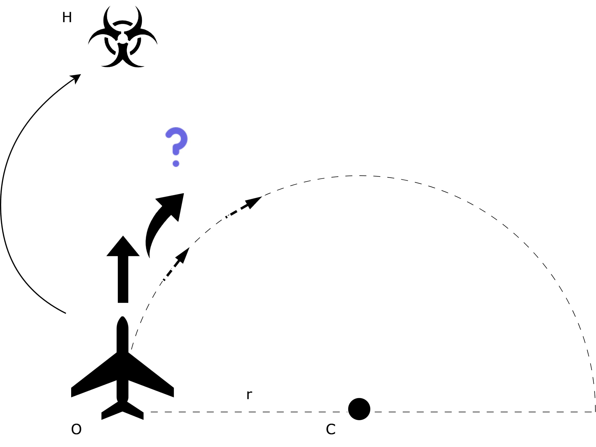
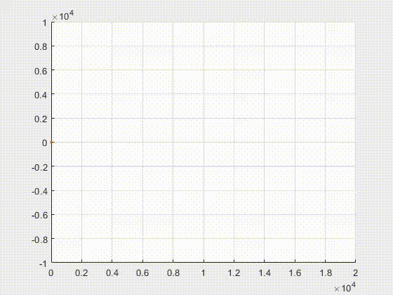

# Bomb dropping simulation
Faculty course project about mathematical modeling

# Problem description
The atomic bomb on Hiroshima was dropped from a B-29 bomber that was not very agile. Therefore, let's assume it was flying at the same altitude of 9600 meters throughout the flight. It flew at a maximum speed of 530 km/h. At the moment t=0, it released the bomb, which exploded on the ground after some time, producing a shock wave with a speed of 350 m/s. To be as far as possible from the target when the shock wave catches up, the plane can turn in the horizontal plane with a maximum curvature radius of 4700 meters. Calculate how far the bomber was when the shock wave caught up with it and how much time had elapsed by then, assuming it was flying the optimal path that maximizes this distance.

# Problem Analysis

## Assumptions

The plane releases a bomb that will initially have the some speed. Given the data, a set of assumptions is introduced to simplify the problem of modeling:

- The experiment takes place in 3D space.
- The plane and the bomb are points in space with positive mass.
- The ground is a plane (two-dimensional surface).
- The shock wave spreads spherically at a constant speed in all directions above the ground.
- The plane moves at a constant speed in the plane z = 9600m.
- Without loss of generality, the plane turns to the right.
- There is no air resistance.
- The modeling contains assumptions of projectile motion (the set functions are continuously differentiable, we are in a vacuum, etc.).

## Idea

At the start of the simulation, the plane is moving towards Hiroshima (and thus towards the zero point – let’s call it H), so the distance to the city initially decreases. If possible, it would be desirable for the plane to move away from point to a distance greater than, which would mean that at some point, it must fly above a circle centered at H.

The idea is to reduce the problem to finding a point on this circle above which the sought optimal path of the plane passes. Intuitively, this could be the point that the bomber reaches the fastest. However, attention should be paid to the direction and path of movement – it would be best if at that moment the plane is flying directly away from the center of the explosion.

# Simulation

## How to start the simulation

Run the `simulation.m` file.

# Paper 

Report written in *Serbian* can be found here [insert link when uploaded].

# About
Project is done by Daniil Grbić, Igor Kandić and Branko Grbić, students of University of Belgrade as a part of the Mathematical Modeling course at Faculty of Mathematics.